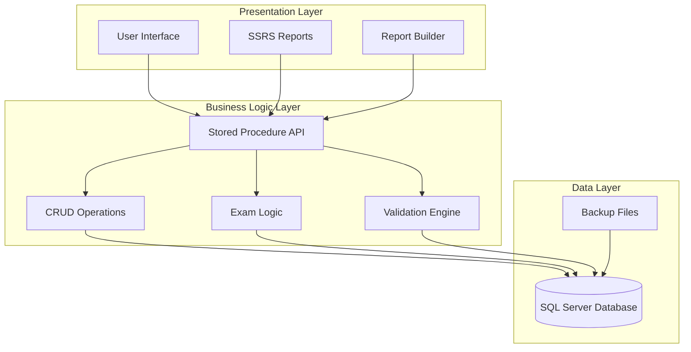
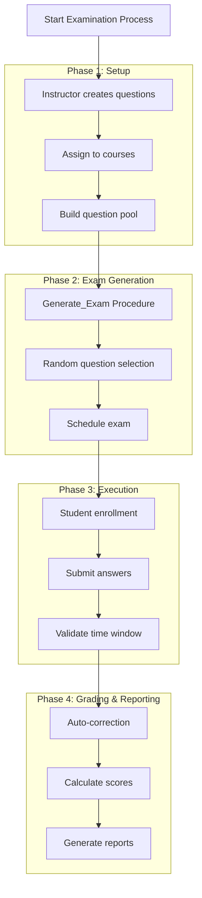
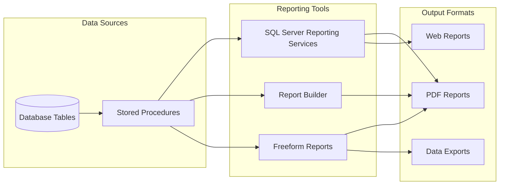

I'll enhance the README with additional visual elements including project architecture, workflow diagrams, and references to the available visual assets in the repository.

# Examination System Database Project

A comprehensive SQL Server database solution for managing educational examinations, including student enrollment, exam generation, grading, and reporting capabilities.

## Overview

This project implements a complete examination management system using SQL Server stored procedures, featuring 112 stored procedures organized across CRUD operations, business logic, and reporting functionalities [1](#4-0) . The system supports multiple-choice and true/false questions, automated exam generation, student answer submission, and comprehensive grading with SSRS reporting.

## Authors

**Team Leader:** Abdalrhman Mohamed Mohamed

**Development Team:**
- Omar Osama Elsayed Gibreel
- Rodan Mohamed Elsaid  
- Reem Mohamed Rashad
- Hana Adel Elsayed

This project was developed as a final project for ITI by the team members listed above [2](#4-1) .

## Project Architecture & Visual Assets

### System Architecture Overview



### Examination Workflow



### Available Visual Assets

📊 **Reports & Documentation**
- 📁 `Reports PDF/` - Contains exported SSRS reports showing actual system output
- 📁 `FreeForm Report/` - SSRS Freeform report layouts and designs
- 📁 `DB Documentation/` - Technical documentation and data dictionaries

🗂️ **Database Schema**
- 📁 `System ERD/Examination System ERD.pdf` - Complete entity-relationship diagram

## Database Structure & ERD

### Entity-Relationship Diagram
The complete ERD diagram is available in the repository at:
- 📁 `System ERD/Examination System ERD.pdf`

This PDF contains the full visual representation of all database tables, relationships, and constraints used in the examination system.

### Database Schema Overview


### Repository Structure

```
├── DB Backup/                          # Database backup file
├── DB Documentation/                   # Technical documentation
├── Stored Procedure Code/              # All T-SQL stored procedures
│   ├── Main_Entities_Stored_Procedures.sql
│   ├── Many_To_Many_Entities_Stored_Procedures.sql
│   ├── Exam_Generation_Answers_Correction_Stored_Procedures.sql
│   ├── Reports_Stored_Procedures.sql
│   └── please_start_with_me.sql        # Simulation script
├── System ERD/                         # Entity-Relationship Diagram
│   └── Examination System ERD.pdf      # Complete database schema visualization
├── Reports PDF/                        # Generated report exports
└── FreeForm Report/                    # SSRS Freeform report layouts
```

## Quick Start

### 1. Database Restoration

1. Open SQL Server Management Studio (SSMS)
2. Right-click **Databases** → **Restore Database**
3. Select **Device** and locate: `DB Backup/db35423_custom_31.12.2025_639027727339467022.bak`
4. Click **OK** to restore

### 2. Run Simulation

Execute the simulation script to populate test data and verify functionality:

```sql
-- Execute the complete simulation
-- This creates 5 exams, enrolls 21 students, and submits answers
EXEC Stored Procedures Code/please_start_with_me.sql
```

The simulation creates:
- 5 exams for different courses (C#, ASP.NET Core, SQL Server, JavaScript, HTML & CSS) [3](#4-2) 
- 21 student enrollments with 210 answer submissions [4](#4-3) 
- Automated grading and report generation

## Core Features

### Database Schema
- **9 Core Tables**: Branch, Track, Instructor, Student, Course, Topic, Question, Choice, Exam
- **8 Junction Tables**: Managing many-to-many relationships
- **User-Defined Table Types**: For bulk data operations (e.g., `ChoiceTableType`)

### Stored Procedure Categories

1. **Main Entity CRUD** (36 procedures)
   - Add/Update/Delete/Get operations for core entities
   - Example: `AddStudent`, `UpdateBranch`, `DeleteCourse` [5](#4-4) 

2. **Many-to-Many Relations** (58 procedures)
   - Managing junction tables and complex relationships
   - Example: `AddStudentExam`, `DeleteTracksByBranchID` [6](#4-5) 

3. **Exam Business Logic** (5 procedures)
   - `Generate_Exam`: Creates randomized exams from course question pools [7](#4-6) 
   - `Student_Exam_Correction`: Automated grading system
   - `AddStudentAnswer`: Answer submission with validation

4. **Reporting Procedures** (6 procedures)
   - SSRS-compatible procedures for generating reports
   - Student grades, course topics, exam questions, etc. [8](#4-7) 

### Key Business Logic

- **Exam Generation**: Randomly selects questions using `NEWID()` to ensure unique exams [9](#4-8) 
- **Validation Rules**: Age constraints (18-45), email format, temporal guards for exam timing
- **Cascade Deletion**: Proper handling of related records with referential integrity

## Reporting System

### Report Generation Architecture



The system integrates with SQL Server Reporting Services (SSRS) and Microsoft Report Builder to generate 6 primary reports [10](#4-9) :

1. Student information by department
2. Student grades across all courses
3. Instructor course assignments and student counts
4. Course topics listing
5. Exam questions and choices
6. Student exam answers with correct choices

## Data Validation

The system enforces business rules through comprehensive validation:

- **Age Validation**: Students must be between 18-45 years old [11](#4-10) 
- **Name Format**: Prevents numeric characters in names
- **Email Pattern**: Validates email format using pattern matching
- **Temporal Constraints**: Prevents exam submission outside scheduled times
- **Question Pool Validation**: Ensures sufficient questions before exam generation

## Technical Specifications

- **Database**: SQL Server
- **Total Stored Procedures**: 112
- **Reporting**: SSRS, Microsoft Report Builder, Freeform Reports
- **Backup Format**: `.bak` file for full environment restoration
- **Testing**: Comprehensive simulation script for end-to-end validation

## Notes

- The `please_start_with_me.sql` script is essential for quick testing and demonstration of all system features
- All stored procedures include comprehensive error handling with `RAISERROR` and `THROW` patterns
- The system uses User-Defined Table Types (UDTT) for efficient bulk operations
- Referential integrity is maintained through proper cascade deletion logic and foreign key constraints
- For the complete visual ERD diagram, refer to `System ERD/Examination System ERD.pdf` in the repository
- Sample reports and layouts are available in `Reports PDF/` and `FreeForm Report/` directories

Wiki pages you might want to explore:
- [Repository Structure and Getting Started (omargibreel/ExaminationSystem-Database-FinalProject-ITI)](/wiki/omargibreel/ExaminationSystem-Database-FinalProject-ITI#1.2)
- [Glossary (omargibreel/ExaminationSystem-Database-FinalProject-ITI)](/wiki/omargibreel/ExaminationSystem-Database-FinalProject-ITI#7)
- [Examination System — Project Overview (omargibreel/ExaminationSystem-Database-FinalProject-ITI)](/wiki/omargibreel/ExaminationSystem-Database-FinalProject-ITI#1)
- [Examination Lifecycle (omargibreel/ExaminationSystem-Database-FinalProject-ITI)](/wiki/omargibreel/ExaminationSystem-Database-FinalProject-ITI#4)

Wiki pages you might want to explore:
- [Examination System — Project Overview (omargibreel/ExaminationSystem-Database-FinalProject-ITI)](/wiki/omargibreel/ExaminationSystem-Database-FinalProject-ITI#1)
- [Repository Structure and Getting Started (omargibreel/ExaminationSystem-Database-FinalProject-ITI)](/wiki/omargibreel/ExaminationSystem-Database-FinalProject-ITI#1.2)
- [Glossary (omargibreel/ExaminationSystem-Database-FinalProject-ITI)](/wiki/omargibreel/ExaminationSystem-Database-FinalProject-ITI#7)

### Citations

**File:** IMPORTANT NOTE.txt (L2-2)
```text
We used "SSRS , Microsoft Report Builder, Microsoft Freeform Report" tool to generate our Reports
```

**File:** IMPORTANT NOTE.txt (L19-19)
```text
*** Total of 112 Stored Procedures ***
```

**File:** IMPORTANT NOTE.txt (L23-23)
```text
5. "please_start_with_me" file : this has a simulation of creating 5 exams for 5 different couses , and assigning 21 students to these exams (each exam has 10 questions) , resulting in 210 rows for student answers + 20 more for the the same student to test the report of getting his degrees in multiple courses. it also has exam correction for some of these students and model answer for exams. IF YOU WANT A QUICK TEST FOR THE REPORT STORED PROCEDURES YOU SHOULD START WITH THIS FILE :)
```

**File:** Team Names.txt (L5-9)
```text
- Reem Mohamed Rashad
- Rodan Mohamed Elsaid
- Hana Adel Elsayed
- Omar Osama Elsayed
- Abdalrhman Mohamed Mohamed
```

**File:** Stored Procedures Code/please_start_with_me.sql (L7-50)
```sql
-- Exam 1: C# Programming
EXEC Generate_Exam
    @CourseName = 'C# Programming',
    @ExamDate = '2026-01-05',
    @StartTime = '09:00',
    @EndTime = '11:00',
    @TotalMCQQuestions = 6,
    @TotalTrueFalseQuestions = 4;

-- Exam 2: ASP.NET Core
EXEC Generate_Exam
    @CourseName = 'ASP.NET Core',
    @ExamDate = '2026-01-06',
    @StartTime = '09:00',
    @EndTime = '11:00',
    @TotalMCQQuestions = 7,
    @TotalTrueFalseQuestions = 3;

-- Exam 3: SQL Server
EXEC Generate_Exam
    @CourseName = 'SQL Server',
    @ExamDate = '2026-01-07',
    @StartTime = '09:00',
    @EndTime = '11:00',
    @TotalMCQQuestions = 5,
    @TotalTrueFalseQuestions = 5;

-- Exam 4: JavaScript
EXEC Generate_Exam
    @CourseName = 'JavaScript',
    @ExamDate = '2026-01-08',
    @StartTime = '09:00',
    @EndTime = '11:00',
    @TotalMCQQuestions = 4,
    @TotalTrueFalseQuestions = 6;

-- Exam 5: HTML & CSS
EXEC Generate_Exam
    @CourseName = 'HTML & CSS',
    @ExamDate = '2026-01-09',
    @StartTime = '09:00',
    @EndTime = '11:00',
    @TotalMCQQuestions = 3,
    @TotalTrueFalseQuestions = 7;
```

**File:** Stored Procedures Code/please_start_with_me.sql (L475-508)
```sql
--/////////////////////////////////////////////////////////////// The 6 Required Reports 


--1. Report that returns the students information according to Department No parameter. (TrackID)

EXEC GetStudentByTrack 1;


--2. Report that takes the student ID and returns the grades of the student in all courses they had an exam on. (StudentID)

EXEC StudentGradesReport 21;


--3. Report that takes the instructor ID and returns the name of the courses that he teaches and the number of student per course. (InstructorID)

EXEC GetCoursesAndStudentsByInstID 2;


--4. Report that takes course ID and returns its topics. (CourseID)

EXEC GetTopicsByCourseId 3;


--5. Report that takes exam number and returns the Questions in it and choices. (ExamID)

EXEC GetExamQuestionsWithChoicesReport 1;


--6. Report that takes exam number and the student ID then returns the Questions in this exam with the student answers. (StudentID , ExamID)

EXEC Student_Exam_Answers 21, 1; -- option 1 : Exam Student Answers without correct choices.

EXEC Student_Exam_Answers_with_Correct_Choices 21, 1; -- option 2 :Exam Student Answers with correct choices.

```

**File:** Stored Procedures Code/Many_To_Many_Entities_Stored_Procedures.sql (L684-706)
```sql


------------------------------------------------- Student Answer
-- 1. Get all Student-Answer details
CREATE PROCEDURE GetAllStudentAnswers
AS
BEGIN
    --SET NOCOUNT ON;

    IF NOT EXISTS (SELECT 1 FROM Student_Answer)
        THROW 50001, 'No Student-Answer records found.', 1;

    SELECT 
        sa.StudentAnswerID,
        s.StudentID,
        s.FirstName + ' ' + s.LastName AS StudentName,
        e.ExamID,
        q.QuestionID,
        q.QuestionText,
        ch.ChoiceID,
        ch.ChoiceLabel,
        ch.ChoiceText,
        sa.IsCorrect,
```

**File:** Stored Procedures Code/Exam_Generation_Answers_Correction_Stored_Procedures.sql (L6-134)
```sql
CREATE PROC Generate_Exam
(
    @CourseName VARCHAR(100),
    @ExamDate DATE,
    @StartTime TIME(7),
    @EndTime TIME(7),
    @TotalMCQQuestions INT,
    @TotalTrueFalseQuestions INT
)
AS
BEGIN
    DECLARE 
        @CourseID INT,
        @ExamID INT,
        @AvailableMCQ INT,
        @AvailableTF INT,
        @TotalGrade DECIMAL(5,2);

    -- 1. Get Course ID
    SELECT @CourseID = CourseID
    FROM Course
    WHERE CourseName = @CourseName;

    IF @CourseID IS NULL
    BEGIN
        RAISERROR('Course not found', 16, 1);
        RETURN;
    END;

    -- 2. Check course has questions
    IF NOT EXISTS (
        SELECT 1
        FROM Question
        WHERE CourseID = @CourseID
    )
    BEGIN
        RAISERROR('Not enough questions found for this course', 16, 1);
        RETURN;
    END;

    -- 3. Count available questions
    SELECT @AvailableMCQ = COUNT(*)
    FROM Question
    WHERE CourseID = @CourseID AND QuestionType = 'M';

    SELECT @AvailableTF = COUNT(*)
    FROM Question
    WHERE CourseID = @CourseID AND QuestionType = 'T';

    -- 4. Validate requested counts
    IF @TotalMCQQuestions > @AvailableMCQ
    BEGIN
        RAISERROR('Not enough MCQ questions. Available: %d', 16, 1, @AvailableMCQ);
        RETURN;
    END;

    IF @TotalTrueFalseQuestions > @AvailableTF
    BEGIN
        RAISERROR('Not enough True/False questions. Available: %d', 16, 1, @AvailableTF);
        RETURN;
    END;

    -- 5. Select random questions
    DECLARE @SelectedQuestions TABLE
    (
        RowNum INT IDENTITY(1,1),
        QuestionID INT,
        QuestionMark DECIMAL(5,2)
    );

    -- Random MCQ
    INSERT INTO @SelectedQuestions (QuestionID, QuestionMark)
    SELECT TOP (@TotalMCQQuestions)
           QuestionID,
           QuestionMark
    FROM Question
    WHERE CourseID = @CourseID AND QuestionType = 'M'
    ORDER BY NEWID();

    -- Random True/False
    INSERT INTO @SelectedQuestions (QuestionID, QuestionMark)
    SELECT TOP (@TotalTrueFalseQuestions)
           QuestionID,
           QuestionMark
    FROM Question
    WHERE CourseID = @CourseID AND QuestionType = 'T'
    ORDER BY NEWID();

    -- 6. Calculate Total Grade
    SELECT @TotalGrade = SUM(QuestionMark)
    FROM @SelectedQuestions;

    -- 7. Insert Exam and get ExamID
    EXEC AddExam
        @ExamDate = @ExamDate,
        @StartTime = @StartTime,
        @EndTime = @EndTime,
        @TotalMCQQuestions = @TotalMCQQuestions,
        @TotalTrueFalseQuestions = @TotalTrueFalseQuestions,
        @TotalGrade = @TotalGrade,
        @ExamID = @ExamID OUTPUT;  -- capture ExamID

    -- 8. Insert Exam Questions
    DECLARE @QuestionID INT,
            @QuestionOrder INT = 1;

    DECLARE ExamCursor CURSOR FOR
        SELECT QuestionID
        FROM @SelectedQuestions
        ORDER BY RowNum;

    OPEN ExamCursor;
    FETCH NEXT FROM ExamCursor INTO @QuestionID;

    WHILE @@FETCH_STATUS = 0
    BEGIN
        EXEC AddExamQuestion
            @ExamId = @ExamID,
            @QuestionId = @QuestionID,
            @QuestionOrder = @QuestionOrder;

        SET @QuestionOrder += 1;
        FETCH NEXT FROM ExamCursor INTO @QuestionID;
    END;

    CLOSE ExamCursor;
    DEALLOCATE ExamCursor;

END;
```
